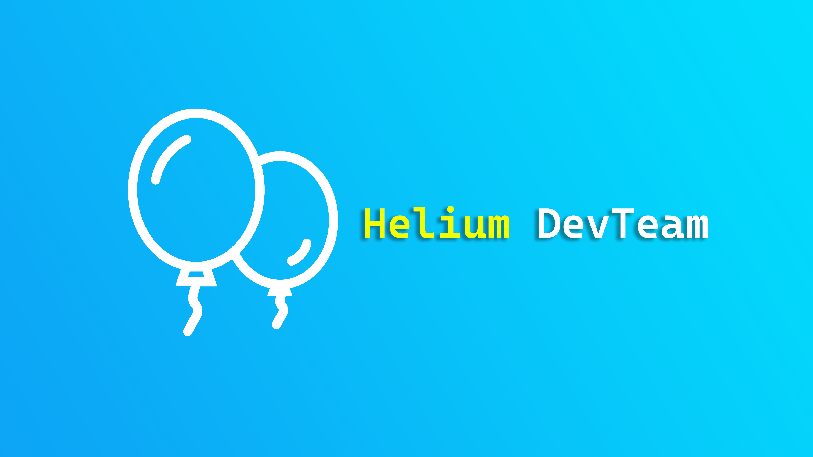

# Helium <small>Pre-Alpha 0.6.1</small>

> An customizable extension system for Minecraft servers.

- Powerful, fast and lightweight
- Written in C++
- Doesn't require any modify or mod to the Minecraft server
- Free software licensed by GPL-3.0-or-later license

[Github](https://github.com/Helium-DevTeam/Helium)
[Gitee](https://gitee.com/Helium-DevTeam/Helium)
[Document](#docsify)

